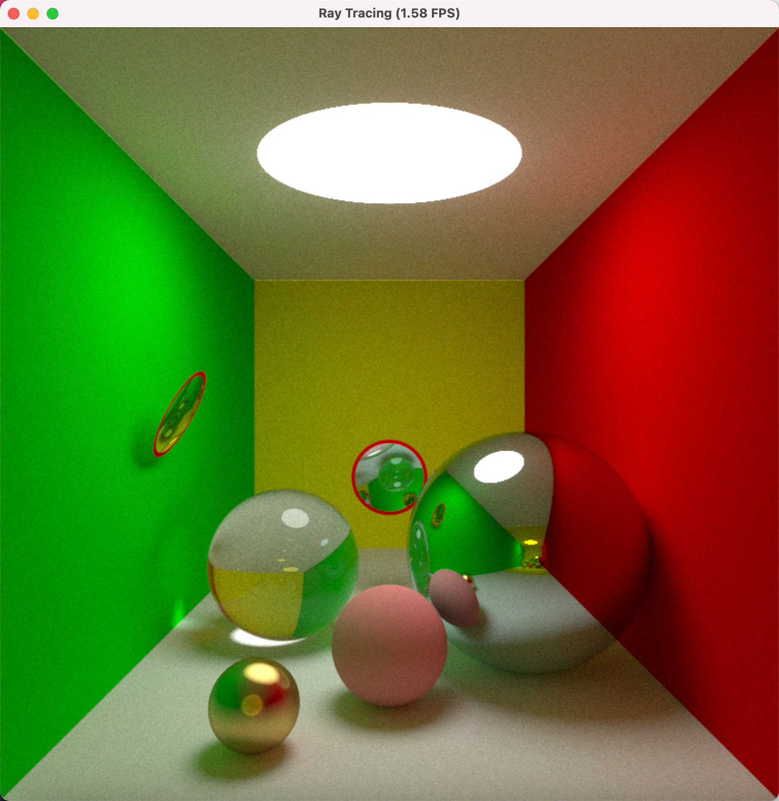

# 太极图形课 S1-大作业

其实挺多想试着做一下的东西的，这次大作业实在跟自己近期时间安排有点冲突太大了，自己的数学水平也有些拖后腿，结果什么都没做成 QAQ。 之后会把想做的东西慢慢补上吧，这次大作业可能就没法完成了。

## TODO Lists

- Spectral Path Tracing (没做完，太难了看不下去 orz)
- BVH (没做)
- Rigid Body Dynamics (没做)
- 渲染 OBJ 文件 (没做)
- 传送门（有一点效果，光线坐标转换的数学不太明白）

## 运行方式

```bash
poetry install
poetry run
```

#### 运行环境：

required: [poetry](https://python-poetry.org/)

```
[Taichi] version 0.8.8, llvm 10.0.0, commit 7bae9c77, osx, python 3.9.9
```

## 效果展示



## 整体结构

```
.
├── LICENSE
├── README.md
├── assets
│   └── bunny.obj
├── poetry.lock
├── poetry.toml
├── pyproject.toml
└── taichi_course01_final
    ├── BVH.py
    ├── Camera.py
    ├── HittableObject
    │   ├── Ellipse.py
    │   ├── Plane.py
    │   ├── Sphere.py
    │   ├── __init__.py
    ├── Main.py
    ├── Ray.py
    ├── Renderer
    │   ├── ColorOnlyRenderer.py
    │   ├── PathTracerRenderer.py
    │   ├── __init__.py
    ├── Scene.py
    ├── Spectrum
    │   ├── CoefficientSpectrum.py
    │   ├── Data.py
    │   ├── RGBSpectrum.py
    │   ├── SampleSepctrum.py
    │   ├── __init__.py
    ├── Types.py
    ├── Utils.py
    └─── __init__.py

```
